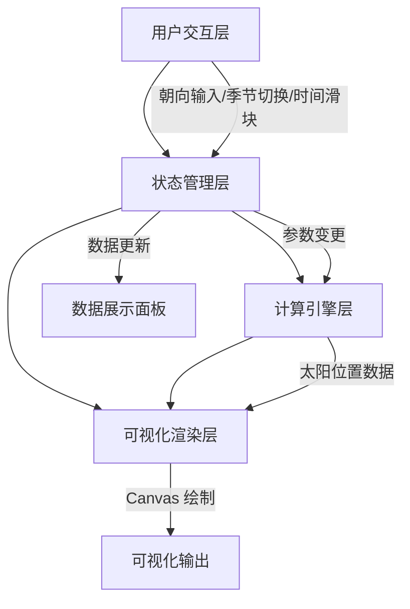
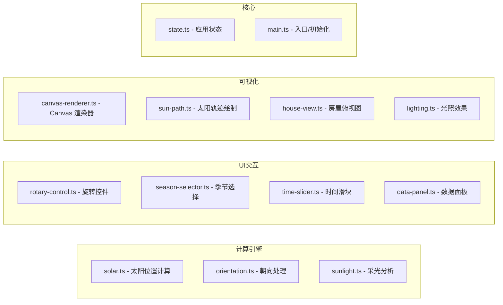
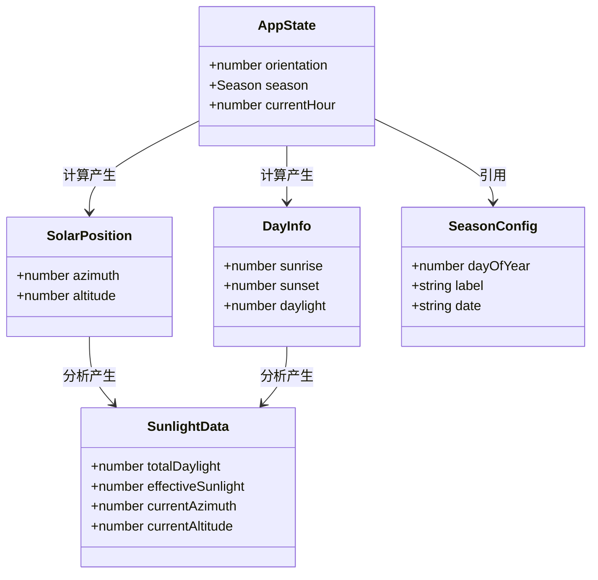
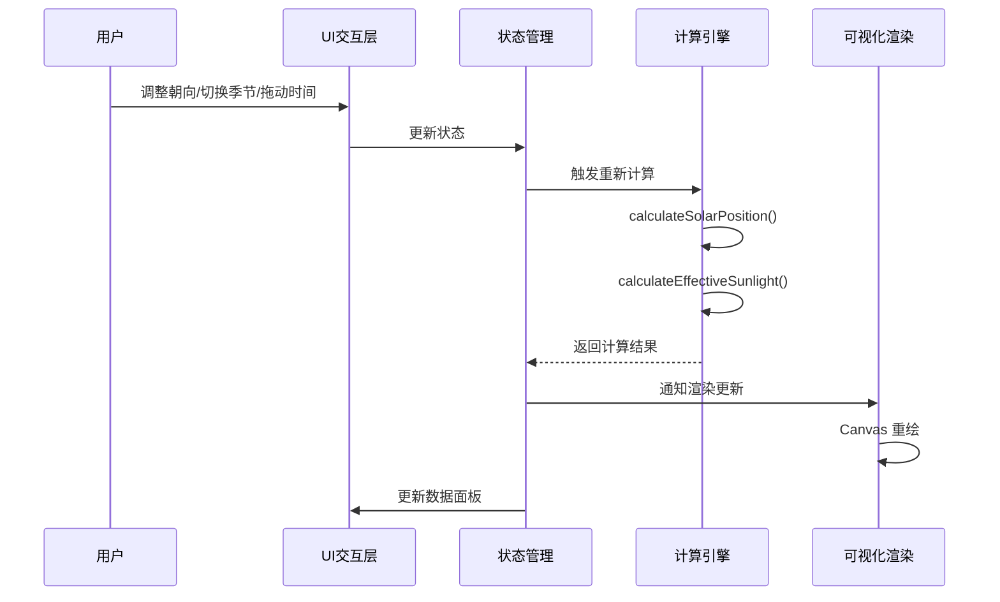

# 技术设计文档：天津房屋采光模拟器

## 概述

天津房屋采光模拟器是一个纯前端 Web 应用，用户可设置房屋朝向角度，系统基于天津地理坐标（39.1°N, 117.2°E）计算太阳轨迹，模拟四季代表日的采光效果。应用采用 HTML/CSS/JavaScript 构建，支持移动端响应式布局，可部署为静态资源。

### 技术选型

- **构建工具**：Vite（轻量、快速，适合纯前端项目）
- **语言**：TypeScript（类型安全，便于测试和维护）
- **UI 渲染**：原生 HTML/CSS + Canvas 2D API（可视化绘制）
- **测试框架**：Vitest（单元测试 + 属性测试）+ Playwright（端到端测试）
- **属性测试库**：fast-check（与 Vitest 集成良好）
- **部署产物**：纯静态文件（HTML/CSS/JS）

### 设计决策说明

1. **不使用前端框架**：项目为单页工具型应用，交互逻辑有限，原生实现可减少包体积，满足 3G 网络下 3 秒加载要求
2. **Canvas 2D 而非 SVG**：太阳轨迹和光照渲染需要频繁重绘，Canvas 性能更优
3. **TypeScript**：太阳位置计算涉及大量数学运算，类型系统有助于减少计算错误
4. **Vite**：零配置即可支持 TypeScript，构建产物体积小，开发体验好

## 架构

### 整体架构

应用采用分层架构，将计算逻辑、UI 交互和可视化渲染分离：



### 模块划分



## 组件与接口

### 1. 太阳位置计算模块 (`solar.ts`)

核心计算模块，实现天文算法计算太阳方位角和高度角。

```typescript
interface SolarPosition {
  azimuth: number;   // 太阳方位角（度），正北为0°顺时针
  altitude: number;  // 太阳高度角（度），地平线为0°
}

interface DayInfo {
  sunrise: number;   // 日出时间（小时，如 6.5 表示 6:30）
  sunset: number;    // 日落时间（小时）
  daylight: number;  // 日照时长（小时）
}

// 计算指定日期和时刻的太阳位置
function calculateSolarPosition(
  latitude: number,
  longitude: number,
  dayOfYear: number,
  hourOfDay: number
): SolarPosition;

// 计算指定日期的日出日落信息
function calculateDayInfo(
  latitude: number,
  longitude: number,
  dayOfYear: number
): DayInfo;

// 计算一天中每小时的太阳位置序列
function calculateDailySolarPath(
  latitude: number,
  longitude: number,
  dayOfYear: number
): SolarPosition[];
```

### 2. 朝向处理模块 (`orientation.ts`)

处理朝向角度的输入、规范化和格式化。

```typescript
// 将任意角度值规范化到 [0, 360) 范围
function normalizeAngle(angle: number): number;

// 角度转方位标签
function angleToLabel(angle: number): string;

// 解析用户输入的角度字符串
function parseOrientation(input: string): number | null;

// 格式化角度为显示字符串
function formatOrientation(angle: number): string;
```

### 3. 采光分析模块 (`sunlight.ts`)

基于太阳位置和房屋朝向计算采光数据。

```typescript
interface SunlightData {
  totalDaylight: number;      // 总日照时长（小时）
  effectiveSunlight: number;  // 有效采光时长（小时）
  currentAzimuth: number;     // 当前太阳方位角
  currentAltitude: number;    // 当前太阳高度角
}

// 计算有效采光时长（太阳直射房屋正面的时间段）
function calculateEffectiveSunlight(
  solarPath: SolarPosition[],
  houseOrientation: number,
  dayInfo: DayInfo
): number;

// 获取完整采光数据
function getSunlightData(
  season: Season,
  houseOrientation: number,
  currentHour: number
): SunlightData;
```

### 4. 应用状态 (`state.ts`)

集中管理应用状态，通知各组件更新。

```typescript
type Season = 'spring' | 'summer' | 'autumn' | 'winter';

interface AppState {
  orientation: number;   // 房屋朝向角度 [0, 360)
  season: Season;        // 当前季节
  currentHour: number;   // 当前时刻（小时）
}

type StateListener = (state: AppState) => void;

class StateManager {
  getState(): AppState;
  setOrientation(angle: number): void;
  setSeason(season: Season): void;
  setCurrentHour(hour: number): void;
  subscribe(listener: StateListener): () => void;
}
```

### 5. Canvas 渲染器 (`canvas-renderer.ts`)

负责在 Canvas 上绘制俯视图、太阳轨迹和光照效果。

```typescript
interface RenderContext {
  canvas: HTMLCanvasElement;
  ctx: CanvasRenderingContext2D;
  width: number;
  height: number;
}

class CanvasRenderer {
  constructor(canvas: HTMLCanvasElement);
  render(state: AppState, solarPath: SolarPosition[], currentPosition: SolarPosition): void;
  resize(): void;
}
```

### 6. 季节配置

```typescript
const SEASON_CONFIG: Record<Season, { dayOfYear: number; label: string; date: string }> = {
  spring: { dayOfYear: 79,  label: '春分', date: '3月20日' },
  summer: { dayOfYear: 172, label: '夏至', date: '6月21日' },
  autumn: { dayOfYear: 265, label: '秋分', date: '9月22日' },
  winter: { dayOfYear: 355, label: '冬至', date: '12月21日' },
};

// 天津地理坐标常量
const TIANJIN_LAT = 39.1;
const TIANJIN_LNG = 117.2;
```


## 数据模型

### 核心数据结构



### 数据流



### 太阳位置计算算法

采用简化的天文算法，基于以下公式：

1. **太阳赤纬角**（δ）：
   ```
   δ = 23.45° × sin(360° × (284 + dayOfYear) / 365)
   ```

2. **时角**（H）：
   ```
   H = 15° × (hourOfDay - 12) + (longitude - 标准经度)
   ```
   天津位于东八区，标准经度为 120°E。

3. **太阳高度角**（α）：
   ```
   sin(α) = sin(lat) × sin(δ) + cos(lat) × cos(δ) × cos(H)
   ```

4. **太阳方位角**（A）：
   ```
   cos(A) = (sin(α) × sin(lat) - sin(δ)) / (cos(α) × cos(lat))
   ```
   根据时角正负判断东西方向。

5. **日出日落时角**（H₀）：
   ```
   cos(H₀) = -tan(lat) × tan(δ)
   ```

### 有效采光判定

房屋正面的有效采光条件：
- 太阳高度角 > 0°（白天）
- 太阳光线与房屋正面法线的夹角 < 90°

计算方式：太阳方位角与房屋朝向角度之差的绝对值 < 90° 时，视为太阳直射房屋正面。

### 文件结构

```
project/
├── index.html
├── src/
│   ├── main.ts              # 入口文件
│   ├── state.ts             # 应用状态管理
│   ├── calc/
│   │   ├── solar.ts         # 太阳位置计算
│   │   ├── orientation.ts   # 朝向处理
│   │   └── sunlight.ts      # 采光分析
│   ├── ui/
│   │   ├── rotary-control.ts  # 旋转控件
│   │   ├── season-selector.ts # 季节选择器
│   │   ├── time-slider.ts     # 时间滑块
│   │   └── data-panel.ts      # 数据展示面板
│   ├── render/
│   │   ├── canvas-renderer.ts # Canvas 渲染器
│   │   ├── sun-path.ts        # 太阳轨迹绘制
│   │   ├── house-view.ts      # 房屋俯视图
│   │   └── lighting.ts        # 光照效果
│   └── types.ts             # 类型定义
├── tests/
│   ├── unit/
│   │   ├── solar.test.ts
│   │   ├── orientation.test.ts
│   │   └── sunlight.test.ts
│   ├── property/
│   │   ├── solar.property.test.ts
│   │   ├── orientation.property.test.ts
│   │   └── sunlight.property.test.ts
│   └── e2e/
│       └── app.spec.ts
├── vite.config.ts
├── tsconfig.json
├── package.json
└── playwright.config.ts
```


## 正确性属性

*属性是指在系统所有有效执行中都应成立的特征或行为——本质上是对系统应做什么的形式化陈述。属性是连接人类可读规格说明与机器可验证正确性保证之间的桥梁。*

### 属性 1：角度规范化范围不变量

*对于任意*数值输入，`normalizeAngle` 函数的输出应始终在 [0, 360) 范围内，且 `normalizeAngle(x)` 与 `x` 模 360 等价。

**验证需求：1.5**

### 属性 2：朝向控件双向同步

*对于任意*有效角度值（0 到 360），通过旋转控件设置该角度后数字输入框应显示相同的值，反之亦然——两个控件始终保持一致。

**验证需求：1.3, 1.4**

### 属性 3：太阳位置计算有效性

*对于任意*有效的日期序号（1-365）和小时值（0-24），`calculateSolarPosition` 返回的方位角应在 [0, 360) 范围内，高度角应在 [-90, 90] 范围内。

**验证需求：2.2**

### 属性 4：夜间标记与高度角一致性

*对于任意*日期和时刻，当计算出的太阳高度角 < 0° 时，该时刻应被标记为夜间且不计入采光时段；当高度角 ≥ 0° 时，该时刻应被标记为白天。

**验证需求：2.5**

### 属性 5：总日照时长等于日落减日出

*对于任意*有效的日期序号，`calculateDayInfo` 返回的 `daylight` 值应等于 `sunset - sunrise`，且 `sunrise < sunset`。

**验证需求：5.1**

### 属性 6：有效采光时长范围不变量

*对于任意*朝向角度和季节组合，有效采光时长应满足 `0 ≤ effectiveSunlight ≤ totalDaylight`。

**验证需求：5.2**

### 属性 7：朝向值往返一致性

*对于任意*有效的朝向角度值，执行 `parseOrientation(formatOrientation(angle))` 应产生与原始角度等价的结果（在规范化后相等）。

**验证需求：8.5**

## 错误处理

### 输入验证错误

| 错误场景 | 处理方式 |
|---------|---------|
| 数字输入框输入非数字字符 | 忽略无效输入，保持当前值不变 |
| 数字输入框输入超出范围的值 | 自动规范化到 [0, 360)（需求 1.5） |
| 数字输入框输入空值 | 恢复为上一个有效值 |

### 计算错误

| 错误场景 | 处理方式 |
|---------|---------|
| 太阳位置计算产生 NaN | 回退到默认值（方位角 180°，高度角 0°），控制台输出警告 |
| 日出/日落计算异常（极端日期） | 使用安全边界值，确保 sunrise < sunset |

### 渲染错误

| 错误场景 | 处理方式 |
|---------|---------|
| Canvas 上下文获取失败 | 显示降级提示信息，隐藏可视化区域 |
| Canvas 尺寸为 0 | 延迟渲染，等待布局完成后重试 |
| 动画帧请求失败 | 使用 setTimeout 降级方案 |

## 测试策略

### 双重测试方法

本项目采用单元测试 + 属性测试 + 端到端测试的三层测试策略：

- **属性测试**（fast-check + Vitest）：验证核心计算模块的通用正确性属性，每个属性测试运行至少 100 次迭代
- **单元测试**（Vitest）：验证具体示例、边界情况和已知天文数据点
- **端到端测试**（Playwright）：验证用户交互流程和 UI 行为

### 属性测试

使用 `fast-check` 库实现属性测试，每个测试对应设计文档中的一个正确性属性。

| 测试文件 | 对应属性 | 标签 |
|---------|---------|------|
| `orientation.property.test.ts` | 属性 1 | Feature: tianjin-sunlight-simulator, Property 1: 角度规范化范围不变量 |
| `orientation.property.test.ts` | 属性 7 | Feature: tianjin-sunlight-simulator, Property 7: 朝向值往返一致性 |
| `solar.property.test.ts` | 属性 3 | Feature: tianjin-sunlight-simulator, Property 3: 太阳位置计算有效性 |
| `solar.property.test.ts` | 属性 4 | Feature: tianjin-sunlight-simulator, Property 4: 夜间标记与高度角一致性 |
| `solar.property.test.ts` | 属性 5 | Feature: tianjin-sunlight-simulator, Property 5: 总日照时长等于日落减日出 |
| `sunlight.property.test.ts` | 属性 6 | Feature: tianjin-sunlight-simulator, Property 6: 有效采光时长范围不变量 |

属性 2（双向同步）为 UI 交互属性，通过端到端测试验证。

### 单元测试

| 测试文件 | 覆盖内容 |
|---------|---------|
| `solar.test.ts` | 已知天文数据点验证（需求 2.3, 2.4 精度要求）、四季代表日的日出日落时间 |
| `orientation.test.ts` | 边界值（0°, 360°, 负数, 大数）、方位标签映射 |
| `sunlight.test.ts` | 特定朝向的有效采光计算、正南朝向冬至日采光最大化验证 |

### 端到端测试

| 测试文件 | 覆盖内容 |
|---------|---------|
| `app.spec.ts` | 旋转控件与数字输入框双向同步（属性 2）、季节切换更新验证、时间滑块交互、响应式布局验证、数据面板更新 |

### 测试执行

- 构建前自动运行：`vitest --run && playwright test`
- 构建脚本中集成测试门禁：测试失败则中止构建（需求 8.3, 8.4）
- 属性测试配置：每个属性测试最少 100 次迭代
